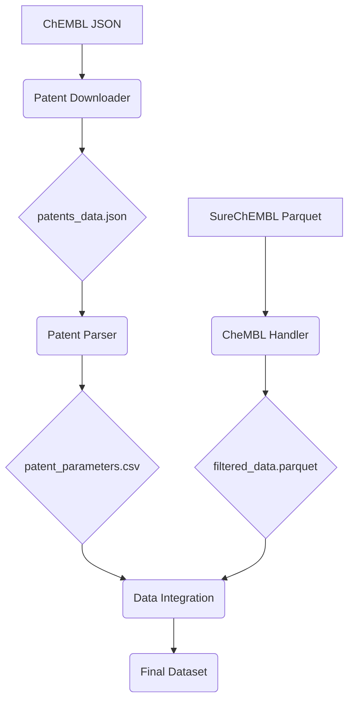

# Патентный Анализатор для Создания Набора Данных о Связывании Лигандов с Белками


Этот репозиторий содержит решение для хакатона Gero по извлечению данных о связывании лигандов с белками из патентных документов с использованием современных подходов ИИ.

## 📖 Описание задачи

Цель проекта - создать открытый набор данных, аналогичный коммерческим базам (Reaxys, GOSTAR), содержащий экспериментальные данные о связывании лигандов с белками из патентов. Основные показатели:
- **IC50**, **Ki**, **Kd**, **EC50** - количественные показатели связывания
- **Мишень (target)** - белок, с которым взаимодействует лиганд
- **SMILES** - структурное представление молекулы
- **Patent ID** - идентификатор патента

## 🧠 Архитектура решения



## ⚙️ Установка и Зависимости

```bash
git clone https://github.com/yourusername/patent-data-extractor.git
cd patent-data-extractor
pip install -r requirements.txt
```

Требования:
- Python 3.9+
- Библиотеки: `pandas`, `requests`, `openai`, `pyarrow`, `tqdm`

## 🚀 Запуск Проекта

### 1. Извлечение патентов для веществ ChEMBL
```bash
python Patent_Downloader.py
```
*Вход:* `chembl_results.json`  
*Выход:* `patents_data.json`

### 2. Парсинг фармакологических параметров из патентов
```bash
python ending.py
```
*Вход:* `patents_data.json`  
*Выход:* `patent_parameters.csv`

### 3. Обработка больших данных из SureChEMBL
```bash
python CheMBL_Handler.py
```
*Вход:* `patents.parquet`, `patent_compound_map.parquet`, `compounds.parquet`  
*Выход:* `filtered_data.parquet`

### 4. Интеграция данных (пример)
```python
import pandas as pd

params = pd.read_csv('patent_parameters.csv')
compounds = pd.read_parquet('filtered_data.parquet')

final_data = pd.merge(
    compounds, 
    params, 
    on='patent_id', 
    how='inner'
)
final_data.to_csv('final_dataset.csv', index=False)
```

## 📂 Описание Файлов

| Файл | Назначение |
|------|------------|
| `Patent_Downloader.py` | Извлечение патентов через Gemini API |
| `ending.py` | Парсинг фармакологических параметров через Llama API |
| `CheMBL_Handler.py` | Обработка больших объемов данных из SureChEMBL |
| `smiles_to_patent.py` | Получение данных из ChEMBL по SMILES |
| `openAI_client_*.py` | Примеры работы с OpenAI-совместимым API |
| `request.sh` | Пример запроса через cURL |
| `patents_data.json` | Пример выходных данных патентного поиска |
| `Описание задачи хакатона Gero.pdf` | Детали задачи |

## 📊 Пример Выходных Данных

### patent_parameters.csv
```csv
patent_id,IC50,Ki,Kd,Konn/Koff,LogP,Cmax,T1/2,Papp,CLint,target
US4374829A,"low nanomolar to micromolar","~0.5 нМ",N/A,N/A,1.37,"159-538 нг/мл","2-3 часа",N/A,N/A,ACE
US4105776A,"~1.7 нМ","~0.5 нМ",N/A,N/A,1.37,"159-538 нг/мл","2-3 часа",N/A,N/A,ACE
...
```

### filtered_data.parquet (схема)
| Столбец | Тип | Описание |
|---------|-----|----------|
| patent_id | string | Идентификатор патента |
| compound_id | int32 | Идентификатор соединения |
| smiles | string | SMILES-представление молекулы |

## 🏆 Результаты Проекта

- Создан автоматизированный пайплайн для извлечения данных из патентов
- Реализована двухэтапная система валидации данных:
  1. Первичный отбор через Gemini API
  2. Верификация через Llama API
- Поддержка обработки больших объемов данных (>1M записей)
- Сгенерирован открытый набор данных с уникальными записями, отсутствующими в BindingDB

## 🔮 Дальнейшее Развитие

1. Интеграция с UniProt API для получения последовательностей белков
2. Добавление автоматической конвертации значений в nM
3. Реализация веб-интерфейса для поиска по набору данных
4. Расширение поддержки дополнительных патентных баз (WIPO, USPTO)

## 🤝 Вклад в Проект

Приветствуются пул-реквесты! Основные направления для улучшения:
- Оптимизация скорости обработки
- Повышение точности извлечения параметров
- Добавление новых источников данных

---

**Лицензия**: MIT  
**Авторы**: Команда хакатона Gero 2024  
**Контакты**: team@example.com
